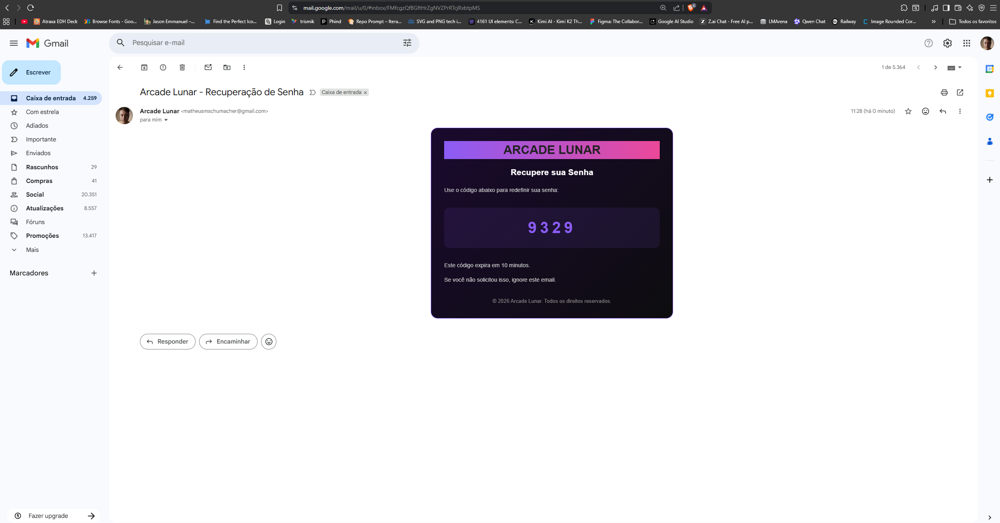

# 🌙 Arcade Lunar

<div align="center">
  
  <br/>
  <b>Connect . Explore . Transcend</b>
  <br/><br/>
  <p>A premium gaming social network and live streaming platform for gamers</p>
</div>

---

## ✨ Features

- 🎮 **Live Streaming** - Watch and broadcast your gaming sessions in real-time
- 👥 **Social Network** - Connect with friends, follow streamers, and join the gaming community
- 💬 **Real-time Chat** - Interactive chat during live streams with emojis and gifts
- 🏆 **Events & Tournaments** - Participate in exclusive gaming events and competitions
- 🎁 **Virtual Gifts** - Send and receive virtual gifts during live streams
- 👤 **User Profiles** - Customize your profile with bio, links, and gaming stats
- 🔐 **Secure Authentication** - Email/Phone login with password recovery via email

---

## 📱 Screenshots

<div align="center">
  <table>
    <tr>
      <td align="center">
        
        <br/><sub><b>Login</b></sub>
      </td>
      <td align="center">
        
        <br/><sub><b>Home</b></sub>
      </td>
      <td align="center">
        
        <br/><sub><b>Live Stream</b></sub>
      </td>
    </tr>
    <tr>
      <td align="center">
        
        <br/><sub><b>Profile</b></sub>
      </td>
      <td align="center">
        
        <br/><sub><b>Password Reset</b></sub>
      </td>
      <td align="center">
        
        <br/><sub><b>Email Verification</b></sub>
      </td>
    </tr>
  </table>
</div>

---

## 🛠️ Tech Stack

### Frontend (Mobile App)
- **Framework:** Flutter 3.2+
- **Language:** Dart
- **State Management:** Provider / setState
- **UI:** Material Design with custom theming
- **HTTP Client:** Dio
- **Caching:** Cached Network Image

### Backend (API Server)
- **Runtime:** Node.js
- **Framework:** Express.js
- **Database:** PostgreSQL
- **Cache:** Redis (ioredis)
- **Authentication:** JWT (jsonwebtoken)
- **Real-time:** Socket.IO
- **Email:** Nodemailer

---

## 📁 Project Structure

```
📦 ArcadeLunar
├── 📂 backend/              # Node.js API Server
│   ├── 📂 migrations/       # Database migrations
│   ├── 📂 src/
│   │   ├── 📂 config/       # Database & Redis configuration
│   │   ├── 📂 controllers/  # Route handlers
│   │   ├── 📂 middleware/   # Auth, rate limiting, etc.
│   │   ├── 📂 models/       # Database models
│   │   ├── 📂 routes/       # API routes
│   │   └── 📂 utils/        # Helper utilities
│   ├── 📄 docker-compose.yml
│   ├── 📄 init.sql          # Database schema
│   └── 📄 package.json
│
├── 📂 frontend/             # Flutter Mobile App
│   ├── 📂 android/          # Android specific files
│   ├── 📂 assets/           # Images, icons, fonts
│   ├── 📂 lib/
│   │   ├── 📂 core/         # Constants, themes, utilities
│   │   ├── 📂 data/         # Models, repositories, services
│   │   └── 📂 presentation/ # Screens, widgets, components
│   ├── 📂 web/              # Web support
│   ├── 📂 windows/          # Windows support
│   └── 📄 pubspec.yaml
│
├── 📂 exemples/             # App screenshots
└── 📄 README.md
```

---

## 🚀 Getting Started

### Prerequisites

- [Flutter SDK](https://flutter.dev/docs/get-started/install) (>=3.2.0)
- [Node.js](https://nodejs.org/) (>=18.x)
- [PostgreSQL](https://www.postgresql.org/) (>=14)
- [Redis](https://redis.io/) (>=7)
- [Docker](https://www.docker.com/) (optional)

### Backend Setup

1. **Navigate to backend directory:**
   ```bash
   cd backend
   ```

2. **Install dependencies:**
   ```bash
   npm install
   ```

3. **Configure environment variables:**
   ```bash
   cp .env.example .env
   # Edit .env with your database credentials and secrets
   ```

4. **Start database with Docker (optional):**
   ```bash
   docker-compose up -d
   ```

5. **Initialize database:**
   ```bash
   psql -U your_user -d your_database -f init.sql
   ```

6. **Start the server:**
   ```bash
   # Development mode (with hot reload)
   npm run dev
   
   # Production mode
   npm start
   ```

The API will be available at `http://localhost:3000`

### Frontend Setup

1. **Navigate to frontend directory:**
   ```bash
   cd frontend
   ```

2. **Install dependencies:**
   ```bash
   flutter pub get
   ```

3. **Configure API endpoint:**
   
   Update the API base URL in `lib/core/constants/api_constants.dart`

4. **Run the app:**
   ```bash
   # Android
   flutter run -d android
   
   # iOS
   flutter run -d ios
   
   # Web
   flutter run -d chrome
   
   # Windows
   flutter run -d windows
   ```

---

## 📄 Environment Variables

Create a `.env` file in the `backend` directory based on `.env.example`:

| Variable | Description |
|----------|-------------|
| `PORT` | Server port (default: 3000) |
| `DATABASE_URL` | PostgreSQL connection string |
| `REDIS_URL` | Redis connection string |
| `JWT_SECRET` | Secret key for JWT tokens |
| `JWT_EXPIRES_IN` | Token expiration time |
| `SMTP_HOST` | Email server host |
| `SMTP_USER` | Email account username |
| `SMTP_PASS` | Email account password |

---

## 🤝 Contributing

Contributions are welcome! Please feel free to submit a Pull Request.

1. Fork the project
2. Create your feature branch (`git checkout -b feature/AmazingFeature`)
3. Commit your changes (`git commit -m 'Add some AmazingFeature'`)
4. Push to the branch (`git push origin feature/AmazingFeature`)
5. Open a Pull Request

---

## 📜 License

This project is licensed under the MIT License - see the [LICENSE](LICENSE) file for details.

---

<div align="center">
  <p>Made with 💜 by the Arcade Lunar Team</p>
  <p>🌙 Connect . Explore . Transcend 🌙</p>
</div>
